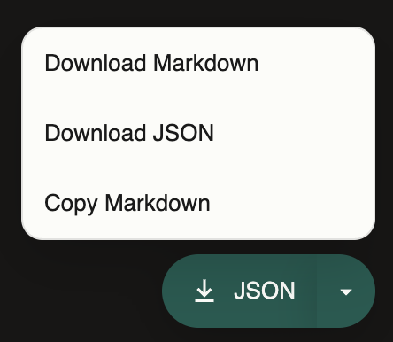
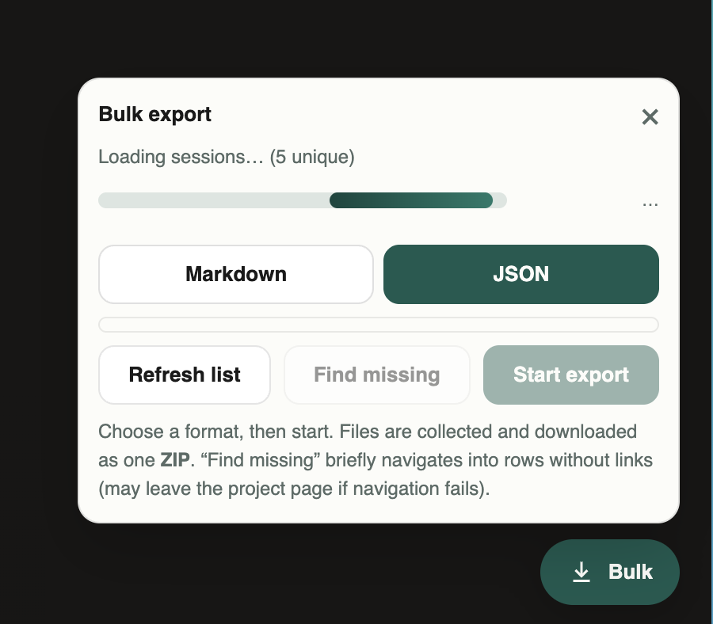

# Perplexport
Chrome extension that exports Perplexity chats to Markdown, JSON, or the clipboard — including bulk ZIP export from Library or a project.

_**Note:** This is a low effort project, but it did what it needed to do for me. In my opinion it's better than most of the existing plugin options that exists (I did try most of them)._

## Install (unpacked / developer mode)

1. Clone this repository
2. Open `chrome://extensions`
3. Enable **Developer mode**
4. Click **Load unpacked**
5. Select this folder

## Usage

### Single thread

1. Open a chat (`/search/…`)
2. Use the button in the bottom-right:
   - Click the main label to export in the last-used format (Markdown or JSON)
   - Open the ▾ menu for **Download Markdown**, **Download JSON**, or **Copy Markdown**

### Bulk from Library or a project

1. Open [Library](https://www.perplexity.ai/library) (`/library`) or a project (`/projects/…`) with the Sessions list
2. Click **Bulk** in the bottom-right
3. Wait while the list scrolls and collects threads (Library keeps loading as you scroll; the extension scrolls for you)
4. Pick **Markdown** or **JSON**, select threads, then **Start export**
5. Each thread opens in a background tab, is scraped, then closed. Results download as ZIP archive(s)

**Auto-batching:** large jobs are split automatically — roughly every **30 threads** or **~10 MB** of content — into `library-part-01.zip` / `project-part-01.zip`, and so on. Small jobs stay a single ZIP. Filenames inside each ZIP: `YYYY-MM-DD-title.md` / `.json`. From **Library**, threads are nested under project folders (e.g. `library/Hodeprat/…`), with threads that have no Space pill in `library/uncategorized/`.

Use **Find missing** only when some Sessions rows have no `/search/` link; it briefly navigates into those rows and can leave the list page if back-navigation fails.

Everything runs locally in the browser. Bulk export needs the `tabs` permission so each thread can be opened in the background.

## License

[MIT](LICENSE)
